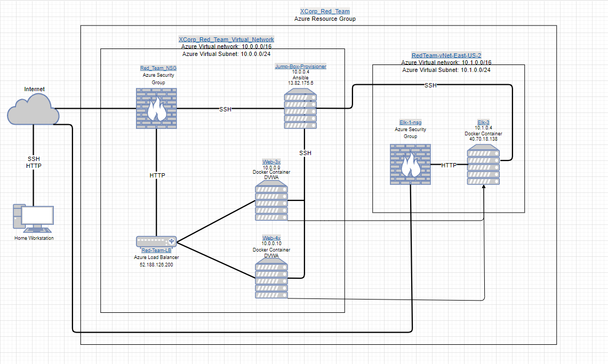
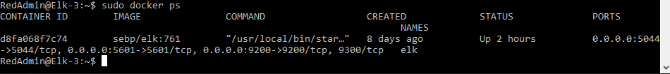

## Automated ELK Stack Deployment

The files in this repository were used to configure the network depicted below.

These files have been tested and used to generate a live ELK deployment on Azure. They can be used to either recreate the entire deployment pictured above. Alternatively, select portions of the Ansible file may be used to install only certain pieces of it, such as Filebeat.

  - _https://github.com/JoeThompsonIII/Elk-Stack-Project/tree/main/Ansible_

This document contains the following details:
- [Description of the Topology](#description-of-the-topology)
- [Access Policies](#access-policies)
- [ELK Configuration](#elk-configuration)
  - [Beats in Use](#target-machines--beats)
  - [Machines Being Monitored](#target-machines--beats)
- [How to Use the Ansible Build](#using-the-playbook)

### Description of the Topology

The main purpose of this network is to expose a load-balanced and monitored instance of DVWA, the D*mn Vulnerable Web Application.

Load balancing ensures that the application will be highly available, in addition to restricting access to the network.
Load balancers help ensure environment availability by distributing HTTP traffic between webservers. Jump boxes allow for more easy administration of multiple systems and provide an additional layer between the outside and internal assets.

By utilizing one virtual machine as a JumpBox the containers in other VMs can be easily modified if needed. One advantage of using a JumpBox is having one origination point for administrative tasks without having to login and go through each VM or container individually. 

Integrating an ELK server allows users to easily monitor the vulnerable VMs for changes to the logs and system trafic.
- Filebeat is a lightweight shipper for forwarding and centralizing log data. Installed as an agent on your servers, Filebeat monitors the log files or locations that you specify, collects log events, and forwards them either to Elasticsearch or Logstash for indexing. https://www.elastic.co/guide/en/beats/filebeat/current/filebeat-overview.html#

- Metricbeat is a lightweight shipper that you can install on your servers to periodically collect metrics from the operating system and from services running on the server. Metricbeat takes the metrics and statistics that it collects and ships them to the output that you specify, such as Elasticsearch or Logstash. https://www.elastic.co/guide/en/beats/metricbeat/current/metricbeat-overview.html#

The configuration details of each machine may be found below.

| Name     | Function | IP Address | Operating System |
|----------|----------|------------|------------------|
| Jump-Box-Provisioner | Gateway      | 10.0.0.4   | Linux            |
| Red-Team-LB | Load Balancer| 52.188.126.200   | Linux            |
| Web-3x   | DVWA Webserer  | 10.0.0.9     | Linux            |
| Web-4x   | DVWA Webserver | 10.0.0.10  | Linux            |
| Elk-3    | Elk Webserver  | 10.1.0.4  | Linux            |

### Access Policies

The machines on the internal network are not exposed to the public Internet. 

Only the Jump-Box-Provisioner machine can accept connections from the Internet. Access to this machine is only allowed from the following IP addresses:
- My Personal IP address

Machines within the network can only be accessed by SSH.
- The ELK-Server is only accessible by SSH from the JumpBox and via web access from Personal IP Address.

A summary of the access policies in place can be found in the table below.

| Name     | Publicly Accessible | Allowed IP Addresses |
|----------|---------------------|----------------------|
| Jump-Box-Provisionerx | No              | Personal IP Address    |
| Red-Team-LB | Yes |  ALL |
| Web-3x         | Yes Thru Load Ballancer|  10.0.0.4 |
| Web-4x         | Yes Thru Load Ballancer |  10.0.0.4 |
| Elk-3         |  No   | Personal IP Address |

### Elk Configuration

Ansible was used to automate configuration of the ELK machine. No configuration was performed manually, which is advantageous because...
- The main advantage of automating the installation process is easy deployment. Multiple servers can easily and quickly be configured over mulitple machines.

The [install-elk.yml](https://github.com/JoeThompsonIII/Elk-Stack-Project/blob/main/Ansible/install-elk.yml) playbook implements the following tasks:
- Increases VM memory to 262144
- Install docker.io
- Install python3-pip
- Install Pyton Docker Module
- Download and launch Docker container sebp/elk:761

The following screenshot displays the result of running `docker ps` after successfully configuring the ELK instance.

### Target Machines & Beats
This ELK server is configured to monitor the following machines:
- Web-3x 10.0.0.9
- Web-4x 10.0.0.10

We have installed the following Beats on these machines:
- Filebeat
- Metricbeat

These Beats allow us to collect the following information from each machine:
- Filebeat is a log data shipper for local files. Installed as an agent on your servers, Filebeat monitors the log directories or specific log files, tails the files, and forwards them either to Elasticsearch or Logstash for indexing. An examle of such are the logs produced from the MySQL database supporting our application.
- Metricbeat collects metrics and statistics on the system. An example of such is cpu usage, which can be used to monitor the system health.

### Using the Playbook
In order to use the playbook, you will need to have an Ansible control node already configured. Assuming you have such a control node provisioned: 

SSH into the control node and follow the steps below:
- Copy the [filebeat-config.yml](Ansible/filebeat-config.yml) file and [metricbeat-config.yml](Ansible/metricbeat-config.yml) file to /etc/ansible/files.
- Update the hosts file to include "(ip_address of elk server) ansible_python_interpreter=/usr/bin/python3". Within this file, name groups using square brackets (currently contains '[webservers]' and '[elk]') surrounding the group-name and under the group-name, replace private IP's with your own respective IP's. You then use these group-names behind the "hosts:" field in the playbooks to specify which machines to apply the playbook.
- Update the config files to include your ELK-server's private IP address. (filebeat-config.yml: lines 1105 & 1805, metricbeat-config.yml: lines 62 & 95)
- [filebeat-playbook.yml](/Ansible/filebeat-playbook.yml) and [metricbeat-playbook.yml](/Ansible/metricbeat-playbook.yml) are the playbooks for filebeat and metricbeat.  Copy them to /etc/ansible/roles.
- Run the playbooks
  - ansible-playbook /etc/ansible/roles/filebeat-playbook.yml
  - ansible-playbook /etc/ansible/roles/metricbeat-playbook.yml  
- Navigate to http://[ELK-server-public-IP]:5601/app/kibana to check that the installation worked as expected.

